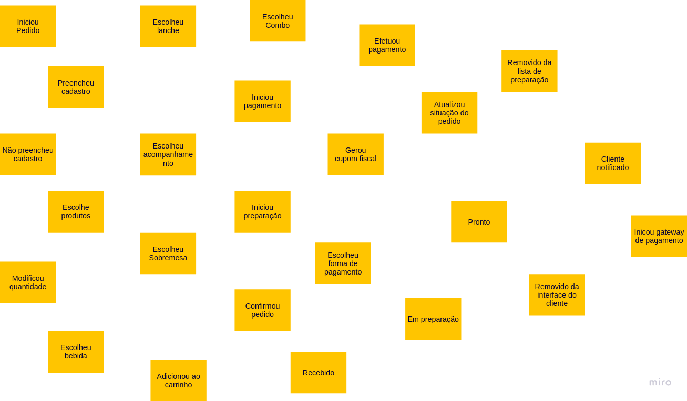

# Fiap | TechChallenger - Grupo-31

<aside>
💡 Documentação**:** A documentação abaixo demonstra o levantamento dos domínios, a definição da linguagem ubíqua e toda a jornada do event storm contendo passo a passo cada fase finalizando com a separação dos contextos delmitados.

</aside>

---

## Domínios

### Domínio

- Venda de produtos atraves de um sistema de autoatendimento de pedidos

### Subdominio Principal

- Pedidos

### Subdominios genéricos

- Cadastro de cliente
- Pagamentos
- Entrega de pedido

### Subdominios de Suporte

- Emissão de cupom fiscal
- Cadastro de produtos
- Cadastro do cliente
- Atualização de sistuação
- Cadastro de categorias de produtos

## **Linguagem Ubíqua**

- Pedido: Conjunto de produtos escolhidos por um cliente
- Cliente: Individuo que tem intenção de fazer um pedido
- Tela: Interface visual para interação do usuário
- Interface visual: Sistema
- Sistema: a aplicação para gerenciamento do pedido
- Cadastro: Dados pessoais do cliente a ser armazenado.
- Produtos: Item que o cliente pode escolher para seu pedido
- Combo: Conjunto de produtos pré estabelecidos
- Lanche: Um tipo de refeição
- Acompanhamento: Um tipo de complemento para uma refeição
- Bebida: Liquido bebível (refrigerante, agua, suco, etc…)
- Sobremesa: Iguaria para ser degustado antes, durante ou após uma refeição (sorvete, pudim, chocolate, doces, etc…)
- Upgrade: Atualização de um pedido incluindo mais produdos
- Quantidade: Quantidade de produtos
- Carrinho: Lista de produtos escolhidos dentro de um pedido
- Forma de pagamento: Opções para realização do pagamento (cartão de débito, cartão de credito ou pix)
- Gateway de pagamento: fornecedor para efetivação do pagamento
- Situação do pedido: estágio do andamento de um pedido
- Situação - Pedido recebido: Quando um pedido chega para a cozinha preparar
- Situação - Pedido em preparação: Quando um pedido já esta sendo preparado pela cozinha
- Situação - Pedido pronto: Quando um pedido foi concluído e já pode ser retirado
- Situação - Pedido finalizado: Quando um pedido já foi retirado
- Notificação: Ato de apresentar em alguma tela uma determinada nota.
- Cupom: Impressão da lista de produtos comprados no pedido com seus valores e quantidades, bem como informações fiscais e um código do pedido.
- Funcionário: Indivíduo que trabalha no estabelecimento

## Mapeamento de processo - Event Storm

### **FASE 1 - BRAINSTORMING**

### **FASE 2 - LINHA DO TEMPO**

### **FASE 3 - EVENTOS PIVOTAIS**

### **FASE 4 - OUTROS ELEMENTOS**

Completo

### **FASE 5 - AGREGADOS**

### **FASE 6 - CONTEXTOS DELIMITADOS**

