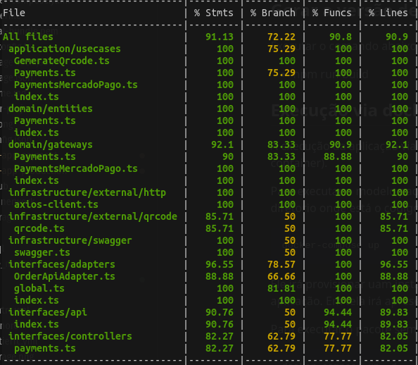
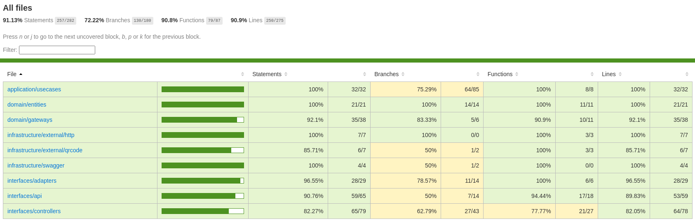

[](https://www.mysql.com/)
   
[](https://www.rabbitmq.com/)


# Tech Challenge - Fase 05 (GRUPO 31) - Sistema de gestão de pedidos - Microserviço de Pagamentos

Consiste no microserviço de um sistema de gestão de pedidos para processamento de pagamentos incluindo as seguintes caracteristicas:

## Caracteristicas

- Enpoint de recebimento do pedido de pagamento
- Webhook para recebimento do callback fake pagamento
- Integração com mercado pago
- Webhook para recebimento do callback do mercado pago
- Pipeline GitActions Workflow para execução de testes e build da imagem em ECR AWS

## Relatório OWASP Zap 

Localizado neste repositório em docs/reports

## Padrão Saga
O padrão de saga coreografado foi selecionado como a abordagem ideal para a comunicação entre os microsserviços envolvidos no processamento de pedidos por diversas razões fundamentais que se alinham com os requisitos e princípios da arquitetura de microsserviços criada em nosso projeto:

- Autonomia e Desacoplamento:
No padrão de saga coreografado, cada microsserviço é autônomo em sua execução e responsabilidade. Isso significa que cada serviço é capaz de tomar decisões e agir de forma independente em resposta aos eventos que ocorrem dentro do sistema. Essa autonomia promove um alto nível de desacoplamento entre os serviços, permitindo que eles evoluam de forma independente e sejam mais facilmente escaláveis.

- Flexibilidade e Resiliência:
O padrão de saga coreografado oferece uma flexibilidade excepcional para lidar com cenários complexos e imprevisíveis. Cada microsserviço é capaz de adaptar seu comportamento em tempo real com base nos eventos que ocorrem no sistema. Isso permite que o sistema se recupere de falhas e exceções de forma mais eficaz, garantindo uma maior resiliência e robustez.

- Escalabilidade Horizontal:
A abordagem coreografada permite uma escalabilidade horizontal eficiente, pois cada microsserviço pode ser escalado independentemente com base em suas próprias demandas de carga de trabalho. Isso possibilita a distribuição do processamento e a utilização eficiente dos recursos disponíveis, garantindo um desempenho otimizado em todo o sistema.

- Dinâmica de Comunicação:
No padrão de saga coreografado, a comunicação entre os microsserviços é baseada em eventos assíncronos e troca de mensagens. Isso permite uma dinâmica de comunicação fluida e adaptável, onde os serviços podem colaborar e coordenar suas atividades de forma eficiente, mesmo em um ambiente distribuído e altamente escalável.

- Baixa Complexidade de Orquestração:
Ao contrário do padrão de saga orquestrado, onde existe um componente centralizado responsável por coordenar e controlar o fluxo de execução, o padrão de saga coreografado possui uma complexidade de orquestração significativamente menor. Cada microsserviço é responsável por coordenar suas próprias atividades em resposta aos eventos que ocorrem no sistema, reduzindo assim a sobrecarga e o ponto único de falha.

#### Baseado nessas considerações, o padrão de saga coreografado foi escolhido como a abordagem mais adequada para a comunicação entre os microsserviços envolvidos no processamento de pedidos. Sua flexibilidade, autonomia e capacidade de lidar com cenários complexos garantem um sistema altamente resiliente, escalável e adaptável às demandas em constante evolução do negócio, bem como a não necessidade de criar um novo microserviço desacoplado com banco de dados isolado para orquestrar todo o processo.


### Criação de Pedido e Pedido de pagamento Modelo coreografado, saga executado com sucesso


### Criação de Pedido e Pedido de pagamento Modelo coreografado, saga entrando em ação compensatória por falha no pedido de pagamento


### Criação de Pedido e Pedido de pagamento Modelo coreografado, saga entrando em ação compensatória por falha na criação da do pedido na cozinha


## Requisitos para execução direta

- Debian: 11 ou superior | Ubuntu: 20
- Node: 18 ou superior
- Banco de dados Mysql

## Requisitos para execução via docker

- Docker: 20 ou superior
- Docker-compose: 1.29.2 ou superior

## Execução dos testes unitários

- npm run test



Coverage



## Execução dos testes unitários

- npm run test

## Gerar a versão de distribuição /dist ( se necessário )

Executar o comando abaixo para gerar automaticamente o dist
- npm run build

## Execução via docker
A execução da aplicação via docker-compose permite a execução do microserviço com escalabilidade horizontal (via replicas do container).

Para executar o modelo padrão da atividade executando 2 instâncias (1 para aplicação e 1 para o banco de dados), acesse o diretorio onde está o código e digite o comando a seguir:

    docker-compose up

Ele irá provisionar uam instância de banco de dados (mysql) e aplicar um build no Dockerfile para provisionar a instância de aplicação. Em tela irá apresentar o log continuo da execução dos serviços.

Para executar o pacote sem visualizar os log's, execute o comando abaixo:

    docker-compose up -d

Para encerrar o serviço digite o comando a seguir: 

    docker-compose down

## Documentação das API's

A documentação pode ser acessada via browser digitando o endereço abaixo quando a aplicação estiver em execução:

    http://localhost:8080/api-docs/

Para acessar diretamente [clique aqui](http://localhost:8080/api-docs/)

O swagger é um framework composto por diversas ferramentas que, independente da linguagem, auxilia a descrição, consumo e visualização de serviços de uma API REST e foi selecionado para documentação dos endpoints do backend da aplicação.

- PAGAMENTO (payments)
    - Permite retornar a lista de pedidos de pagamento
    - Efetua o pedido de pagamento para o broker (fake e meli)
    - Permite retornar um pedido de pagamento com seu respectivo status por ID
    - Endpoint webhook para fake pagamento
    - Endpoint webhook para execução do pagamento vindo do mercado pago

## Requisitos para jornada de teste

### Mercado pago

É necessário incluir no docker-compose.yaml e no deployment-apis.yaml e pod-apis.yaml as enviroment (env) da configuração do mercado pago.

```
MELI_USER_ID: 
MELI_POSID: 
MELI_TOKEN: 
```


## Jornada de teste

Retorna lista de pedidos
```
curl --location 'http://localhost:8080/payment'
```

Retorna lista de pedidos por id
```
curl --location 'http://localhost:8080/payment/{id}'
```

Efetua pedido de pagamento fake
```
curl --location 'http://localhost:8080/payment' \
--header 'Content-Type: application/json' \
--data '{
  "orderId": "123456789",
  "broker": "fake",
  "quantity": 1,
  "amount": 10
}'

```

Efetua pedido de pagamento mercado pago
```
curl --location 'http://localhost:8080/payment' \
--header 'Content-Type: application/json' \
--data '{
  "orderId": "123456789",
  "broker": "mercadopago",
  "quantity": 1,
  "amount": 10
}'

```


#### Webhook para o pagamento 'fake': validação APPROVED, DENIED, CANCELED
```
curl --location 'http://localhost:8080/payment/webhook/{IdPedidoPagamento}' \
--header 'Content-Type: application/json' \
--data '{
    "status": "APPROVED",
    "description": ""
}'
```

#### Webhook para o pagamento 'mercadopago'
```
curl --location 'http://localhost:8080/payment/webhook/mercadopago/{IdPedidoPagamento}' \
--header 'Content-Type: application/json' \
--data '{
  "action": "payment.created",
  "api_version": "v1",
  "data": {
    "id": "62769692566"
  },
  "date_created": "2023-08-26T20:38:56Z",
  "id": 107245981863,
  "live_mode": true,
  "type": "payment",
  "user_id": "157842011"
}'
```
Para representar o teste acima configure o enviroment "MELI_WEBHOOK" com o link do webhook.site, export curl e troque o "https://webhook.site/XXXXXXXXXXXXXXXXXXXXXXXX/" por "http://localhost:8080/payment/webhook/mercadopago/" e execute o post para obter o resultado de pagamento


## Requisitos para teste unitário automatizado via GitActions e BuildImage para registro no ECR AWS

* [Terraform](https://www.terraform.io/) - Terraform is an open-source infrastructure as code software tool that provides a consistent CLI workflow to manage hundreds of cloud services. Terraform codifies cloud APIs into declarative configuration files.
* [Amazon AWS Account](https://aws.amazon.com/it/console/) - Amazon AWS account with billing enabled
* [aws cli](https://aws.amazon.com/cli/) optional

## Antes de começar

Esta execução esta fora do nível gratuito da AWS, importante avaliar antes de executar

## AWS configuração

Com os requisitos já identificados, configure abaixo no secrets do github.

```
AWS_ACCESS_KEY = "xxxxxxxxxxxxxxxxx"
AWS_SECRET_KEY = "xxxxxxxxxxxxxxxxx"
SONAR_HOST_URL = "xxxxxxxxxxxxxxxxx"
SONAR_TOKEN    = "xxxxxxxxxxxxxxxxx"
```

## Uso

Com os requisitos já identificados, as variáveis configuradas no secrets do github.

Efetue o Pull Request com a branch master para executar o processo de

- Teste
- Sonarqube
- Deploy

### Execução do projeto

Ao efetuar um push no repositório develop com sucesso, é necessário efetuar um pull request na branch master para que a execução do pipeline do workflow seja executado
